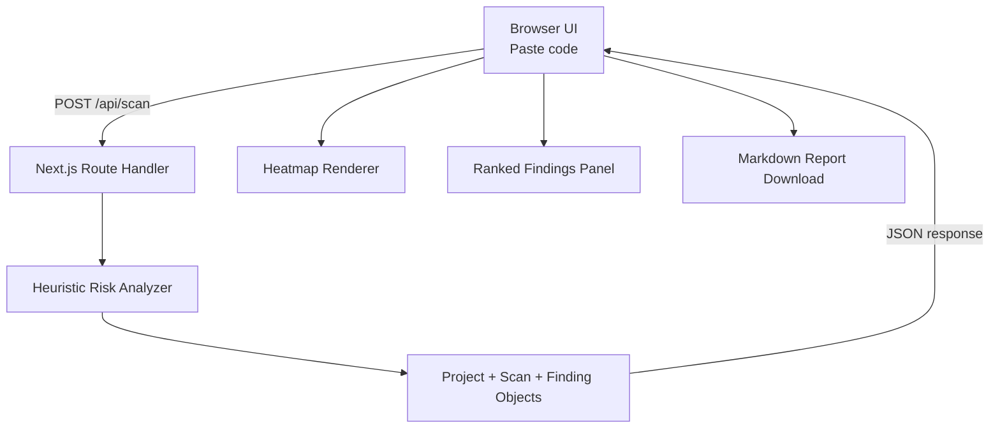

# Code Claim Map

A tiny dev tool that scans pasted code and highlights the lines most likely to need tests, docs, or follow-up work. It turns static code into a prioritized maintenance-risk heatmap with short explanations and a downloadable Markdown report.

## Core MVP feature

Paste code into the app, click **Scan Code**, and get:

- A line-by-line annotated heatmap
- Ranked findings with scores and reasons
- Project, scan, and finding records generated in the API response
- A downloadable Markdown report

This MVP uses deterministic local heuristics. No external API key or database is required.

## Architecture



## Run locally

Requirements:

- Node.js 18.17+ recommended
- npm

```bash
npm install
npm run dev
```

Open [http://localhost:3000](http://localhost:3000).

## Environment variables

Copy the example file if you want to customize the app metadata:

```bash
cp .env.example .env.local
```

| Variable | Required | Default | Description |
| --- | --- | --- | --- |
| `NEXT_PUBLIC_APP_NAME` | No | `Code Claim Map` | Display name used by the client. |

## How scoring works

The scanner assigns risk points for signals that often indicate maintenance burden, such as:

- Control-flow complexity (`if`, `else`, loops, `switch`, `catch`)
- Async/network/database/file operations
- Error handling and thrown exceptions
- Security-sensitive operations (`eval`, SQL-like strings, tokens/passwords)
- TODO/FIXME comments
- Very long lines
- Public function/class definitions without nearby doc comments
- Return statements and state mutation

The score is capped at 100 and converted into a label:

- `High risk` for 75+
- `Needs tests` for 50-74
- `Needs docs` for 30-49
- `Follow-up` for 1-29

## Smoke test

With the dev server running, paste the sample code shown on the page and scan it. You should see highlighted lines and a downloadable report button.
